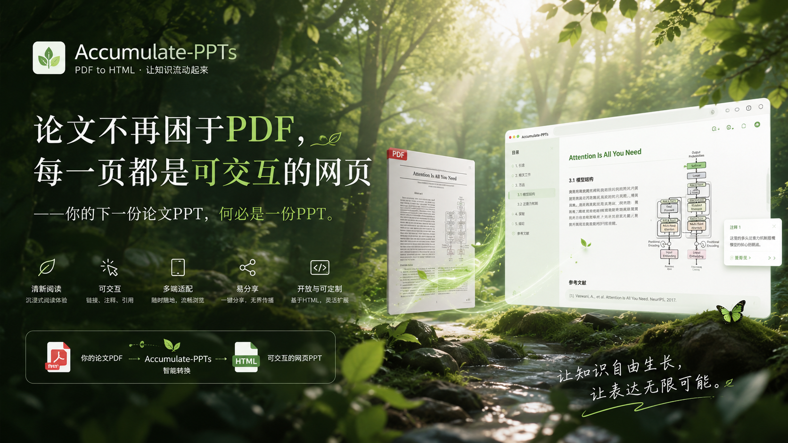
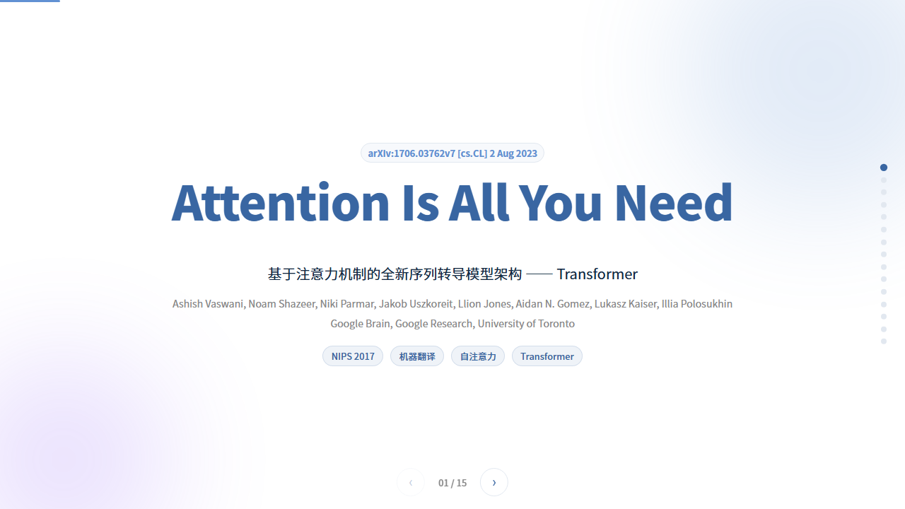
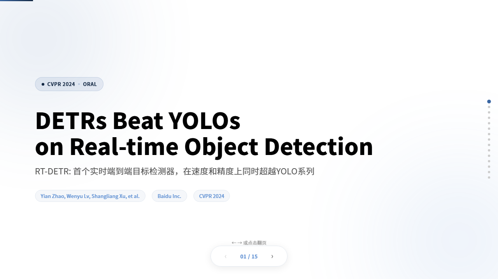
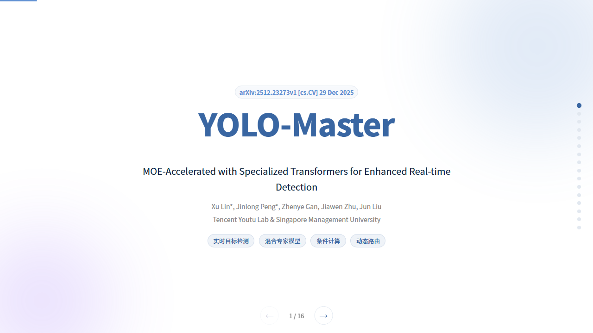
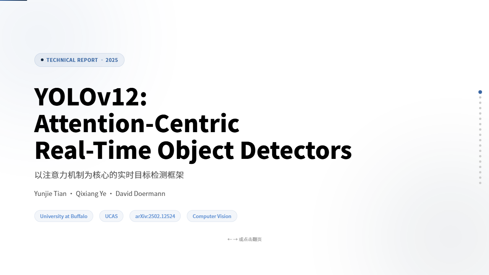
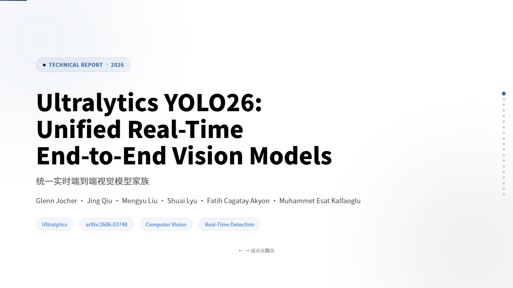
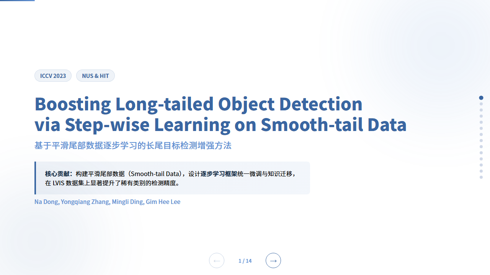

# Accumulate-PPTs

🌐 [中文](README.md) · [English](#)

> **"Type one sentence. Get a presentation-ready paper deck."**
> *AI 打一句话,一份能直接讲的论文 PPT 落地。*

[](LICENSE)
[](https://luoqianshi.github.io/Accumulate-PPTs/)
[](#-skill-matrix)
[](#-contact)
[]()

<p align="center">
  
</p>

---

## 30-Second Overview

`Accumulate-PPTs` is an HTML slide workflow repository built for **graduate students and undergraduates**. It packages the most painful path — *read a paper → present it → defend it* — into 3 AI-Agent-callable SKILLs. Give one prompt in natural language, and the Agent will produce an Apple-style / Notion-style **single-file HTML** deck in 5–20 minutes, ready to play in any browser and embed in your personal homepage.

- **Paper reading / group meeting / thesis defense** → `html-paper-slides`
- **Student cadre report / club annual review** → `html-work-report-slides`
- **General-purpose presentation** → `html-slides`

**The essential difference from PowerPoint / Gamma / Notion Slides**: we deliver **offline single-file HTML** that is reproducible, version-controllable, and deployable to GitHub Pages as a personal portfolio.

---

## Quick Start

```bash
git clone https://github.com/luoqianshi/Accumulate-PPTs.git
cd Accumulate-PPTs
```

Open the project in any AI IDE that supports Skills (Claude Code / TRAE / CodeBuddy), and send the Agent this prompt:

```markdown
Please use the html-paper-slides skill (skills\html-paper-slides\SKILL.md)
to make an HTML paper-presentation PPT for ./raw/my-paper.pdf.
The final file should be saved in the paper-slides directory.
```

5–15 minutes later, a browser-playable single-file HTML deck will appear in `paper-slides/`, and it will be auto-listed in the gallery at `index.html`.

---

## Skill Matrix

The repository ships with 3 SKILLs, covering the three most common presentation scenarios for graduate students and undergraduates:

| SKILL | Typical Scenario | Input | Output | Typical Time |
|------|------------------|-------|--------|--------------|
| [`html-paper-slides`](skills/html-paper-slides/SKILL.md) | Paper reading · Thesis defense · Research progress report | One PDF paper | Single-file HTML deck + thumbnail | 8–15 min |
| [`html-work-report-slides`](skills/html-work-report-slides/SKILL.md) | Student cadre report · Club / department annual review | Markdown outline / draft | Apple-style / Notion-style single-file HTML | 10–20 min |
| [`html-slides`](skills/html-slides/SKILL.md) | Course presentation · Book sharing · General topics | Markdown / free text | Generic HTML slides | 5–15 min |

All outputs are **offline single-file HTML**: zero external dependencies, `file://` open, keyboard navigation, fade-in animations, CSS-Grid responsive layout. Deploy with one click to GitHub Pages / Vercel / Netlify.

---

## Showcase · Real Paper Decks

The 7 decks below were all generated with `html-paper-slides` assisted by an AI Agent. Click any thumbnail to preview:

<table>
  <tr>
    <td align="center" width="50%">
      <a href="paper-slides/Attention_Is_All_You_Need.html">
        
      </a>
      <br><b>Attention Is All You Need</b>
      <br><sub>Transformer classic · Multi-head attention · SOTA on machine translation</sub>
    </td>
    <td align="center" width="50%">
      <a href="paper-slides/DETRs_Beat_YOLOs_on_Real-time_Object_Detection.html">
        
      </a>
      <br><b>DETRs Beat YOLOs on Real-time Object Detection</b>
      <br><sub>CVPR 2024 Oral · RT-DETR · End-to-end real-time detection</sub>
    </td>
  </tr>
  <tr>
    <td align="center" width="50%">
      <a href="paper-slides/YOLO-Master_Presentation.html">
        
      </a>
      <br><b>YOLO-Master: MoE-Accelerated YOLO</b>
      <br><sub>Specialized decoders · MoE acceleration · Real-time detection</sub>
    </td>
    <td align="center" width="50%">
      <a href="paper-slides/YOLOv12_Attention-Centric.html">
        
      </a>
      <br><b>YOLOv12: Attention-Centric Real-Time Detectors</b>
      <br><sub>Area Attention · R-ELAN · Attention-centric</sub>
    </td>
  </tr>
  <tr>
    <td align="center" width="50%">
      <a href="paper-slides/YOLO26_Unified_Real-Time_Vision.html">
        
      </a>
      <br><b>Ultralytics YOLO26: Unified Real-Time Vision</b>
      <br><sub>DFL-free · MuSGD · Unified multi-task</sub>
    </td>
    <td align="center" width="50%">
      <a href="paper-slides/smooth-tail_learning.html">
        
      </a>
      <br><b>Boosting Long-tailed Object Detection</b>
      <br><sub>ICCV 2023 · Smooth-tail data · Step-wise learning</sub>
    </td>
  </tr>
  <tr>
    <td align="center" width="50%">
      <a href="paper-slides/Dialogue_Director.html">
        
      </a>
      <br><b>Dialogue Director</b>
      <br><sub>Dialogue visualization · Three-agent framework · Film knowledge integration</sub>
    </td>
    <td align="center" width="50%">
      <i>More decks coming · see <a href="https://luoqianshi.github.io/Accumulate-PPTs/">online gallery</a></i>
    </td>
  </tr>
</table>

> Online gallery: https://luoqianshi.github.io/Accumulate-PPTs/

---

## Core Workflow: raw → ingest → HTML PPT

The repository's differentiator is unifying "paper reading" and "deck generation" into one **reproducible, version-controlled** workflow:

```
┌──────────┐    ┌──────────┐    ┌────────────────┐
│   raw    │ →  │  ingest  │ →  │  HTML PPT      │
│  Source  │    │  MD      │    │  Single-file   │
└──────────┘    └──────────┘    └────────────────┘
  PDF / URLs       Info card +      paper-slides/
  Supplements      Summary +        output/
                   Outline
```

### 1. `raw/` — Source Archive
Store the paper PDF, supplementary materials, web links, author info, dataset notes, code repo URLs, and temporary excerpts. Don't polish, just keep sources complete and traceable. Recommended: organize by topic or file name, and record title, year, venue, authors, paper link, code link, and data source.

### 2. `ingest/` — Markdown Distillation
The core layer for paper understanding and content compression. Distill `raw/` materials into structured Markdown, focusing on: **research problem & motivation, core contributions, method framework, key modules, experimental setup, core metrics, ablation conclusions, visualization evidence, limitations, reproducibility practices,** and a **presentation outline**. Each intermediate draft should follow the structure *Paper Info Card + Key Summary + Method Breakdown + Experiment Conclusion + Outline*, ready to be converted into HTML PPT.

### 3. `HTML PPT` — Final Deliverable
Convert the structured `ingest/` content into single-file decks. Paper decks go to `paper-slides/`; course or general content goes to `output/`. Keep a clear chapter flow: **Cover → Abstract → Introduction → Method → Experiments → Ablation → Conclusion & Outlook**, reinforced with cards, flow diagrams, comparison tables, metric highlights, and navigation controls. After ingestion into the gallery, **always update `slides-manifest.json`** so `index.html` can render title, path, description, kind, and accent correctly. Then run `python skills/html-paper-slides/scripts/generate-thumbnails.py` to generate real cover thumbnails for the gallery cards.

### Quality Checklist
Before moving to the next stage, confirm:
- `raw/` can be traced back to the original source
- `ingest/` has distilled enough material to support an 8–15 page report
- The HTML PPT opens as a single file, supports keyboard navigation, and has clear visual hierarchy
- `slides-manifest.json` covers all HTML files in `paper-slides/`
- `assets/thumbnails/` contains matching thumbnails, with the `thumbnail` field correctly set in manifest

---

## Project Structure

```
Accumulate-PPTs/
├── index.html            # HTML Slides Gallery homepage (auto-deployed via GitHub Pages)
├── slides-manifest.json  # paper-slides deck manifest
├── README.md             # Chinese README (default)
├── README.en.md          # English README
├── LICENSE               # MIT License
├── paper-slides/         # Paper reading / thesis defense / research report HTML PPT outputs
│   ├── Attention_Is_All_You_Need.html
│   ├── DETRs_Beat_YOLOs_on_Real-time_Object_Detection.html
│   └── ... (more paper decks)
├── skills/               # Slide-creation skills, scripts, and template docs
│   ├── html-paper-slides/        # Paper-reading / defense scenario
│   │   ├── SKILL.md
│   │   ├── scripts/
│   │   │   ├── pdf_extractor.py   # Extract key figures from paper PDFs
│   │   │   └── generate-thumbnails.py  # Generate first-screen thumbnails
│   │   └── templates/
│   │       └── presentation.html  # Paper-presentation HTML slide template
│   ├── html-work-report-slides/  # Student cadre / club reporting scenario
│   │   └── SKILL.md
│   └── html-slides/              # Generic HTML slide creation skill
│       ├── SKILL.md
│       └── templates/
│           └── presentation.html
├── assets/               # Shared static assets
│   ├── thumbnails/       # HTML slide first-screen thumbnails (auto-generated)
│   ├── design-prompts/   # Style design prompt collection
│   ├── accmulate-ppts.png
│   └── favicon.png
├── raw/                  # Original papers and assets, retaining PDFs and other first-hand materials
├── ingest/               # Distilled Markdown intermediate drafts and extracted assets
└── output/               # Generic HTML PPT output area, for drafts, courses, or non-paper decks
```

---

## Getting Started

### 1. Prepare the environment

```bash
git clone https://github.com/luoqianshi/Accumulate-PPTs.git
cd Accumulate-PPTs
```

- Delete all `.html` files in `paper-slides/` (these are the author's personal data)
- Clear the `slides` array in `slides-manifest.json`
- (Optional) Install thumbnail dependencies: `pip install playwright && playwright install chromium`

### 2. Choose a scenario, launch the AI Agent

Open the project in an AI IDE such as `Claude Code` / `TRAE` / `CodeBuddy`.

**Paper presentation scenario:**

```markdown
Please use the html-paper-slides skill (skills\html-paper-slides\SKILL.md)
to make an HTML paper-presentation PPT for [path to your PDF paper].
The final file should be saved in the paper-slides directory.
```

**Student work report scenario:**

```markdown
Please use the html-work-report-slides skill (skills\html-work-report-slides\SKILL.md)
to make an HTML student-work-report PPT.
The final file should be saved in the output directory.
```

**General-purpose scenario:**

```markdown
Please use the html-slides skill (skills\html-slides\SKILL.md)
to make an HTML presentation on [given topic].
```

### 3. Generate thumbnails and auto-include in the gallery

```bash
python skills/html-paper-slides/scripts/generate-thumbnails.py
```

After that, the new HTML PPT will appear in the `index.html` gallery with its **real first-screen cover**. Pushing to GitHub triggers GitHub Actions to auto-deploy to GitHub Pages.

---

## Tech Stack

- **HTML5 + CSS3** — Deck body
- **Vanilla JavaScript** — Pagination engine, keyboard interaction, fade-in animations (no framework dependency)
- **CSS Grid / Flexbox** — 16:9 responsive layout
- **CSS Variables** — Theme color and font variable management
- **Google Fonts** — Noto Sans SC (Chinese) + Inter (English / numbers)
- **Playwright (Python)** — Auto-generate HTML PPT first-screen thumbnails
- **GitHub Actions** — Auto-deploy `index.html` to GitHub Pages

---

## Comparison with Alternatives

| Dimension | PowerPoint | Gamma | Notion Slides | **Accumulate-PPTs** |
|-----------|-----------|-------|---------------|---------------------|
| Onboarding cost | Medium (need to learn layout) | Low (web drag-and-drop) | Low (inside Notion) | **One sentence** (talk to the Agent) |
| Automatic paper figure extraction | Not supported | Not supported | Not supported | **Supported** (`pdf_extractor.py`) |
| AI Agent workflow | Manual coordination | Semi-auto | Not supported | **Native support** |
| Offline single file | `.pptx` | Web only | Web only | **Single-file HTML** |
| Version control / reproducibility | Average | Difficult | Difficult | **Git-friendly** |
| Deployment cost | Microsoft 365 | Subscription | Notion | **GitHub Pages free** |
| Customizable templates | Fully free | Limited | Limited | **Fully free (pure HTML/CSS)** |
| Commercial License | Subscription | Subscription | Subscription | **MIT open source** |

> **Positioning tagline**: PowerPoint is a graphics tool, Gamma is an AI web product, Accumulate-PPTs is the **Agent skill that makes the graphics-tool layer disappear**.

---

## Limitations

We pursue an 80-point stable, usable experience rather than 100-point perfection:

1. **PDF figure extraction has redundancy**: we recommend manually deleting redundant images after the first version, with VLM-based figure selection coming in future releases
2. **Multimodal models work best**: native multimodal models like KIMI K2.6 and Minimax M3 are recommended — pure text models will miss paper figures
3. **Current version is a high-quality first draft**: we recommend multiple rounds of dialog refinement with the Agent, e.g. "replace page 5 method diagram with architecture diagram" / "add the school logo to the footer"
4. **No direct generation from LaTeX source**: if you need LaTeX fidelity, please use Beamer; this repository focuses on "start with PDF / Markdown"
5. **Thumbnails depend on Playwright**: the first run requires `pip install playwright && playwright install chromium`; headless server environments need `--with-deps`

---

## License

This project is fully open-sourced under the **MIT License**, free for personal and commercial use, no prior authorization required.
See the [LICENSE](LICENSE) file for details.

---

## Acknowledgements

- [html-presentation](https://github.com/juanjuanjie/html-presentation) — original HTML slide template and playback engine reference
- [Claude Code](https://claude.com/claude-code) · [CodeBuddy](https://www.codebuddy.ai/) · [TRAE](https://www.trae.ai/) — AI Agent platforms
- All open-source paper authors and the open-source community

---

## Contact

Stars, forks, issues, and PRs are welcome. If you want to discuss graduate studies / paper reading / Agent workflows, find me via:

| Platform | Account / Link |
|----------|----------------|
| GitHub | [@luoqianshi](https://github.com/luoqianshi) |
| Online Gallery | [luoqianshi.github.io/Accumulate-PPTs](https://luoqianshi.github.io/Accumulate-PPTs/) |

---

## Star History

If this repository helps you, please consider giving a Star to support our continued iteration:

<a href="https://star-history.com/#luoqianshi/Accumulate-PPTs&Date">
  
</a>

---

*Last Updated: 2026-06-13 · v1.0 · 7 paper decks collected*
